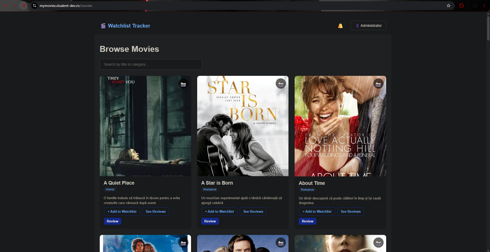
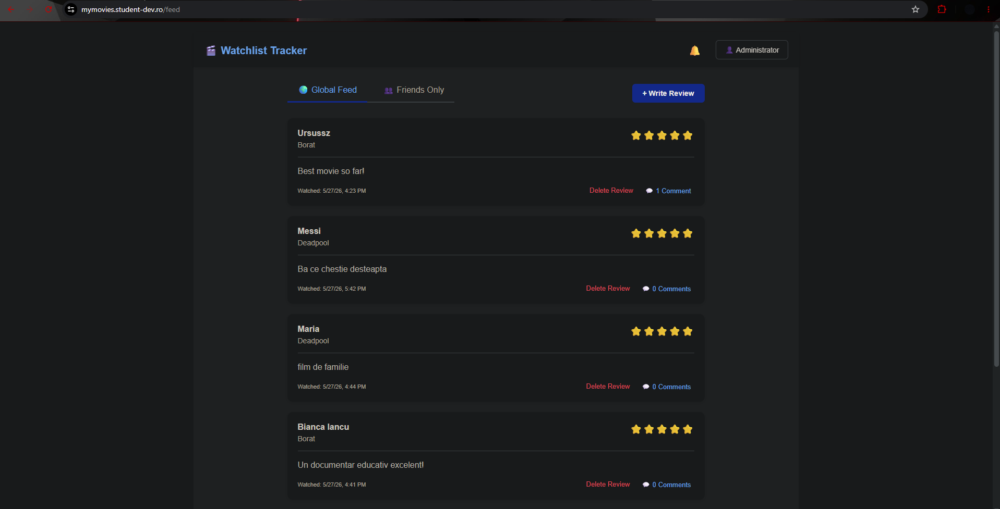
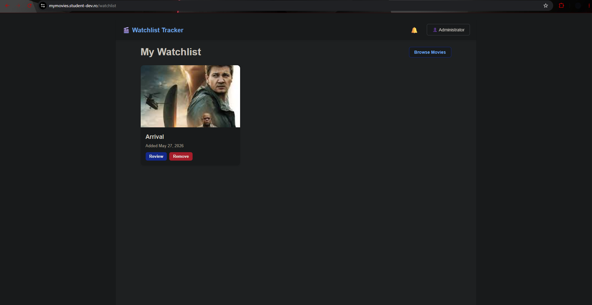
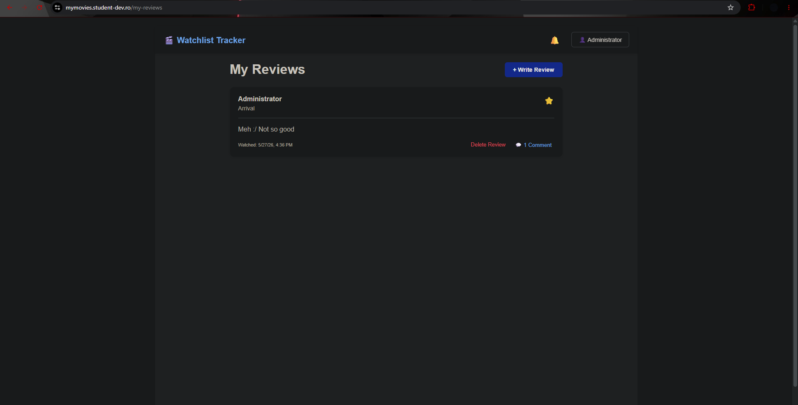
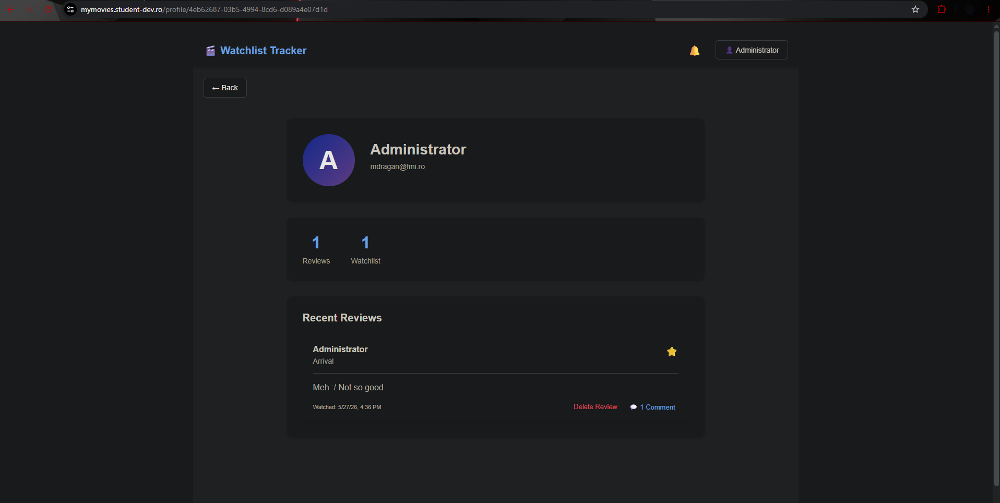
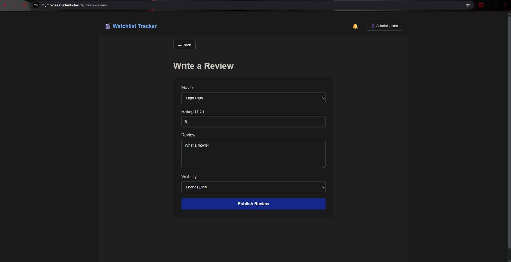
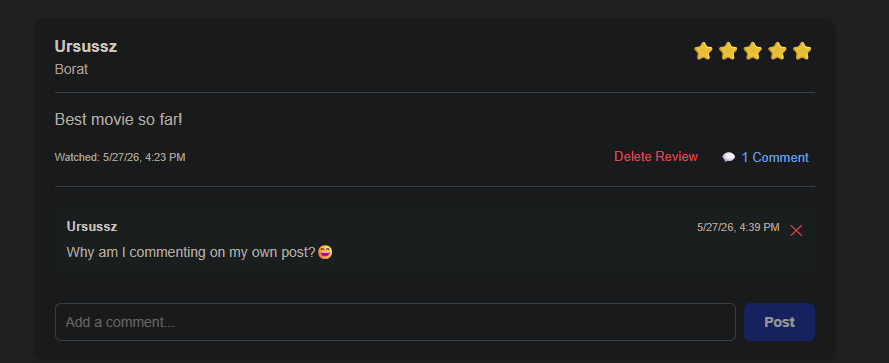

# Watchlist Tracker

A simple watchlist + social reviews app for movies.

## Screenshots

### Home / Movies list


### Reviews feed


### Watchlist


### My Reviews


### Profile


### Create review


### Comments


---

## What I built

- **Authentication & authorization**
  - Register / login using **JWT**
  - **ASP.NET Identity** for user management
  - Role-based access (seeded **Admin** role)
- **Movies**
  - List movies and view details
  - (Admin) upload movie images (stored in `wwwroot/images`)
- **Reviews**
  - Create / update / delete reviews
  - Visibility: **Public** or **FriendsOnly**
  - Feeds: Global feed and Friends feed
- **Comments**
  - Add comments to reviews
  - Delete own comments (or admin can moderate)
- **Watchlist**
  - Add/remove movies to/from personal watchlist
  - Unique constraint: a movie can’t be added twice for the same user
- **Friendships**
  - Send friend requests, accept/reject them

---

## Tech stack (backend)

- **.NET**: ASP.NET Core Web API (`net10.0`)
- **Database**: SQL Server + **Entity Framework Core** (migrations)
- **Auth**: ASP.NET Identity + JWT Bearer authentication
- **Logging**: Serilog (console + `logs/watchlist.txt`)
- **API docs**: OpenAPI/Swagger (enabled in Development)

---

## Project structure (backend folders)

- `Controllers/` — HTTP endpoints (Auth, Movies, Reviews, Comments, Watchlist, Friendships, Users)
- `Services/` — business logic (permissions, validation rules, flows)
- `Repositories/` — database queries (EF Core) + generic repository
- `Data/` — `AppDbContext` + `SeedData` (roles/admin + initial categories/movies)
- `Models/` — EF Core entities (Movie, Review, Comment, Watchlist, Friendship, Category, ApplicationUser)
- `DTOs/` — request/response models (keeps API shape stable)
- `Mappings/` — entity ↔ DTO mapping extensions
- `Middleware/` — global exception handler (consistent JSON errors)
- `Migrations/` — EF Core schema history

---

## Configuration (JWT + admin seed)

The app reads configuration from ASP.NET Core `IConfiguration`:
- `appsettings.json` (defaults/placeholders)
- **Environment variables** (override values; used in Docker Compose)

### Required environment variables (Docker)

These are referenced in `docker-compose.yml` (recommended for secrets):

- `JWT_KEY`
- `JWT_ISSUER`
- `JWT_AUDIENCE`
- `SEED_ADMIN_EMAIL`
- `SEED_ADMIN_PASSWORD`
- `SQL_SA_PASSWORD`
- `DB_NAME`

See `.env.example` for the full list.

---

## Running the backend

### Option A: Docker Compose (recommended)

1) Create a `.env` file (based on `.env.example`) and fill in real values.

2) Start services:

```bash
docker compose --env-file .env up -d --build
```

This starts:
- SQL Server container (`db`)
- ASP.NET API container (`api`)
- Frontend container (`frontend`)

> Note: the backend seed (roles + admin + initial data) runs automatically at startup.

### Option B: Local run (without Docker)

1) Make sure you have a SQL Server instance available and update `ConnectionStrings:DefaultConnection`.
2) Provide JWT settings (either in `appsettings.json` placeholders for local dev, or env vars like `Jwt__Key`, `Jwt__Issuer`, `Jwt__Audience`).
3) Run:

```bash
dotnet run
```

---

## API overview (high level)

- `POST /api/auth/register` — create user + return JWT
- `POST /api/auth/login` — login + return JWT
- `GET /api/movies` — list movies
- `GET /api/reviews/feed/global` — global feed (requires auth)
- `GET /api/reviews/feed/friends` — friends feed (requires auth)
- `GET /api/watchlist` — current user watchlist (requires auth)
- `POST /api/friendships/request/{receiverId}` — send friend request (requires auth)

Swagger/OpenAPI is available in Development.

---

## Frontend

The frontend (Angular) consumes the API endpoints above. The backend enables CORS for local development.